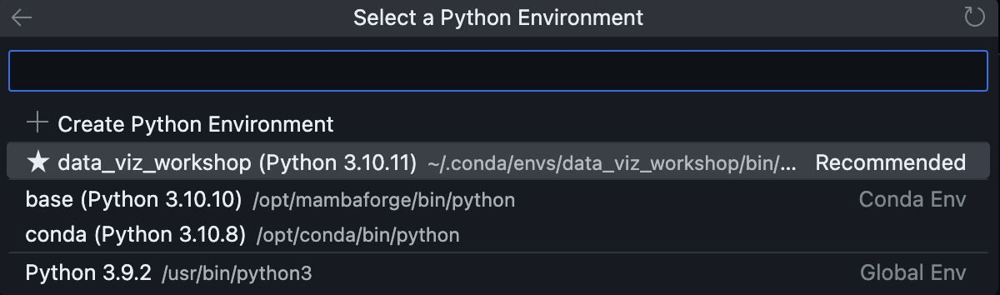

# Welcome to the devcontainer for Beyond the Basics: Data Visualization in Python!

You will be running through the workshop in Visual Studio Code using the Jupyter extension to interact with Jupyter Notebooks. Each time you open a new Jupyter Notebook, you will need to select the kernel (specify the virtual environment to use).

Start by opening up the [`notebooks/0-check_your_env.ipynb`](./notebooks/0-check_your_env.ipynb) notebook and clicking the **Select Kernel** button at the top right:

Select the **Python Environments...** option:

Select the **data_viz_workshop** option:

Use the same option for all subsequent notebooks.