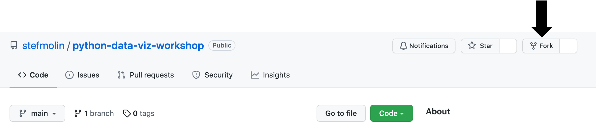
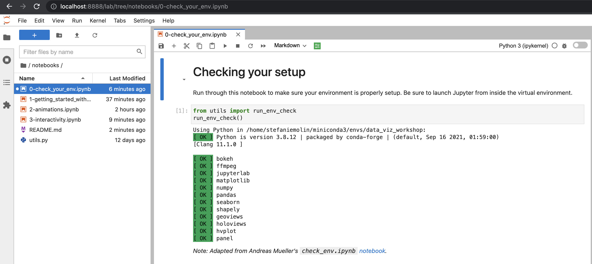
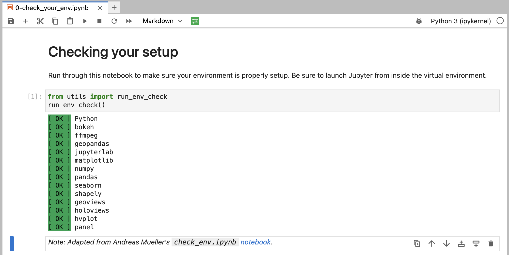

# Beyond the Basics: Data Visualization in Python

[](https://mybinder.org/v2/gh/stefmolin/python-data-viz-workshop/main?urlpath=lab) [](https://nbviewer.jupyter.org/github/stefmolin/python-data-viz-workshop/tree/main/) [](https://stefmolin.github.io/python-data-viz-workshop/slides/html/workshop.slides.html#/)

The human brain excels at finding patterns in visual representations, which is why data visualizations are essential to any analysis. Done right, they bridge the gap between those analyzing the data and those consuming the analysis. However, learning to create impactful, aesthetically-pleasing visualizations can often be challenging. This session will equip you with the skills to make customized visualizations for your data using Python.

While there are many plotting libraries to choose from, the prolific Matplotlib library is always a great place to start. Since various Python data science libraries utilize Matplotlib under the hood, familiarity with Matplotlib itself gives you the flexibility to fine tune the resulting visualizations (e.g., add annotations, animate, etc.). This session will also introduce interactive visualizations using HoloViz, which provides a higher-level plotting API capable of using Matplotlib and Bokeh (a Python library for generating interactive, JavaScript-powered visualizations) under the hood.

## Workshop Outline

This is a workshop on data visualization in Python first delivered at [ODSC West 2021](https://odsc.com/speakers/introduction-to-data-visualization-in-python/) and subsequently at [ODSC East 2022](https://odsc.com/speakers/introduction-to-data-visualization-in-python/) and [PyCon Italia 2022](https://pycon.it/en/talk/beyond-the-basics-data-visualization-in-python?day=2022-06-03). It's divided into the following sections:

### Section 1: Getting Started With Matplotlib
We will begin by familiarizing ourselves with Matplotlib. Moving beyond the default options, we will explore how to customize various aspects of our visualizations. By the end of this section, you will be able to generate plots using the Matplotlib API directly, as well as customize the plots that libraries like pandas and Seaborn create for you.

### Section 2: Moving Beyond Static Visualizations
Static visualizations are limited in how much information they can show. To move beyond these limitations, we can create animated and/or interactive visualizations. Animations make it possible for our visualizations to tell a story through movement of the plot components (e.g., bars, points, lines). Interactivity makes it possible to explore the data visually by hiding and displaying information based on user interest. In this section, we will focus on creating animated visualizations using Matplotlib before moving on to create interactive visualizations in the next section.

### Section 3: Building Interactive Visualizations for Data Exploration
When exploring our data, interactive visualizations can provide the most value. Without having to create multiple iterations of the same plot, we can use mouse actions (e.g., click, hover, zoom, etc.) to explore different aspects and subsets of the data. In this section, we will learn how to use a few of the libraries in the HoloViz ecosystem to create interactive visualizations for exploring our data utilizing the Bokeh backend.


---

## Prerequisites
You should have basic knowledge of Python and be comfortable working in Jupyter Notebooks. Check out [this notebook](https://github.com/stefmolin/Hands-On-Data-Analysis-with-Pandas-2nd-edition/blob/master/ch_01/python_101.ipynb) for a crash course in Python or work through the [official Python tutorial](https://docs.python.org/3/tutorial/) for a more formal introduction. The environment we will use for this workshop comes with JupyterLab, which is pretty intuitive, but be sure to familiarize yourself [using notebooks in JupyterLab](https://jupyterlab.readthedocs.io/en/latest/user/notebook.html) and [additional functionality in JupyterLab](https://dzone.com/articles/getting-started-with-jupyterlab). In addition, a basic understanding of `pandas` will be beneficial, but is not required; reviewing the first section of my [pandas workshop](https://github.com/stefmolin/pandas-workshop) will be sufficient.

---

## Setup Instructions
0. Install [Anaconda](https://docs.anaconda.com/anaconda/install/)/[Miniconda](https://docs.conda.io/en/latest/miniconda.html). Note that you can use [this](https://mybinder.org/v2/gh/stefmolin/python-data-viz-workshop/main?urlpath=lab) Binder environment instead if you don't want to install anything on your machine.
1. Fork this repository:

    

2. Clone your forked repository:

    

3. Create and activate a conda virtual environment (on Windows, these commands should be run in **Anaconda Prompt**):

    ```shell
    $ cd python-data-viz-workshop
    ~/python-data-viz-workshop$ conda install mamba -n base -c conda-forge
    ~/python-data-viz-workshop$ mamba env create --file environment.yml
    ~/python-data-viz-workshop$ conda activate data_viz_workshop
    (data_viz_workshop) ~/python-data-viz-workshop$
    ```

4. Launch JupyterLab:

    ```shell
    (data_viz_workshop) ~/python-data-viz-workshop$ jupyter lab
    ```

5. Navigate to the `0-check_your_env.ipynb` notebook in the `notebooks/` folder:

    

6. Run the notebook to confirm everything is set up properly:

    

---

## About the Author
Stefanie Molin ([@stefmolin](https://github.com/stefmolin)) is a software engineer and data scientist at Bloomberg in New York City, where she tackles tough problems in information security, particularly those revolving around data wrangling/visualization, building tools for gathering data, and knowledge sharing. She is also the author of [Hands-On Data Analysis with Pandas](https://www.amazon.com/dp/1800563450/), which is currently in its second edition. She holds a bachelor’s of science degree in operations research from Columbia University's Fu Foundation School of Engineering and Applied Science. She is currently pursuing a master’s degree in computer science, with a specialization in machine learning, from Georgia Tech. In her free time, she enjoys traveling the world, inventing new recipes, and learning new languages spoken among both people and computers.


## Related Content
All examples herein were developed exclusively for this workshop. [Hands-On Data Analysis with Pandas](https://www.amazon.com/dp/1800563450/) contains additional examples and exercises, as does [this](https://medium.com/@stefaniemolin/how-to-pivot-and-plot-data-with-pandas-9450939fcf8) blog post and [this](https://github.com/stefmolin/pandas-workshop) workshop on pandas.
